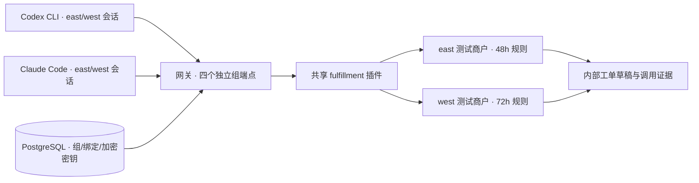

# MCP 网关真实智能体场景验证报告

**结论：在本次物流异常分诊场景中，网关可以支持真实智能体完成多步骤读取、规则判断和有幂等保护的内部写操作；两个客户端、四个独立智能体任务全部通过。** 这是一轮业务闭环验证，不是生产稳定性认证或模型性能排行榜。

运行时间：北京时间 2026-09-27 01:39:28—01:40:27（原始记录使用 UTC）。网关使用 2 个 Uvicorn worker。真实调用执行完毕后，临时 PostgreSQL、Redis、上游业务服务和网关进程均已清理。

## 场景与实际创建的智能体

任务是审查商户订单、读取商户自己的物流升级规则、查询物流轨迹、计算停滞时长，为符合规则的订单创建内部升级工单草稿，然后提交带真实工单编号的 JSON 报告。

创建了四个独立会话：`codex-east`、`codex-west`、`claude-east`、`claude-west`。采用 Codex CLI 0.157.1 与 Claude Code 2.1.170，禁用本地 shell/内置业务外工具，将各自工具面限定为当前网关组的 4 个工具。没有手写模型调用顺序，也没有将预期订单答案写入提示词。

Claude Code 的运行结果报告模型为 **`deepseek-v4-pro[1m]`**，所以这里不能称为“Claude 模型对比”。Codex 的 JSONL 结果未报告模型标识，本报告不推断其具体模型。客户端版本、usage 和实际工具调用保存在 [summary.json](summary.json)。



上游商户系统是本地 HTTP 测试服务，订单数据是合成数据；模型推理、MCP 通信、网关鉴权、密钥注入和工具执行均真实发生。没有向真实客户发消息，没有退款，也没有操作真实订单。

## 实际结果

| 智能体 | 耗时 | MCP 调用数 | 正确升级订单 | 结果 |
|---|---:|---:|---|---|
| Claude Code / west | 8.81 秒 | 8 | ORD-102、ORD-104 | 通过 |
| Claude Code / east | 10.41 秒 | 10 | ORD-101、ORD-104 | 通过；503 后成功重试 |
| Codex CLI / west | 42.96 秒 | 8 | ORD-102、ORD-104 | 通过 |
| Codex CLI / east | 46.40 秒 | 9 | ORD-101、ORD-104 | 通过；503 后成功重试 |

四个任务共发生 35 次业务工具调用，包括 8 次草稿创建请求。业务系统最终只保存 4 个工单：

| 商户 | 工单 | 规则依据 |
|---|---|---|
| east | CASE-EAST-ORD-101 | 在途，停滞 72h，超过 48h |
| east | CASE-EAST-ORD-104 | 异常，停滞 96h，超过 48h |
| west | CASE-WEST-ORD-102 | 异常，停滞 96h，超过 72h |
| west | CASE-WEST-ORD-104 | 在途，停滞 84h，超过 72h |

另外 4 次创建请求返回已存在的草稿。幂等规则由测试业务系统实现，没有重复工单。四个智能体都正确排除了已取消、已送达或未达到本商户阈值的订单。Claude Code/east 额外查询了一次已取消订单的物流，造成 1 次可避免的读取，但没有错误写入。

两种客户端的模型接入、系统提示词和缓存状态不同，而且只有一轮样本。因此表中的时间仅记录本次观测，不能用于判断哪个客户端或模型更快、更便宜或更可靠。

## 为什么这次结果可以核验

成功判定同时依据三层证据：

1. 客户端的 MCP 工具调用记录与最终结构化答案。
2. 上游按 `group`、`call_id` 记录的真实 HTTP 调用和 merchant 身份。
3. 业务系统实际保存的工单对象，而不是智能体自称创建成功。

[业务调用及工单证据](business-evidence.json) 包含 35 个调用事件和 4 个真实保存的测试工单。事后使用加强的判定器复核了工单对象的 `case_id/status` 和调用工具白名单，四个任务仍全部通过，见 [复核结果](recheck.json)。原始捕获结果没有被改写为复核结果。

以下检查也通过：

- 两家商户共用工具代码和订单编号，但密钥、阈值和物流数据不同；四个任务没有出现跨商户数据串用。
- 每个组的 schema 只有业务参数，未暴露 runtime 或上游 api_key。
- 已声明但未绑定的 `refund` 哨兵工具没有出现在任何组的工具目录。
- 另一组的静态 Key 返回 401；任务结束后撤销的 Key 也返回 401。这两项是测试控制器执行的协议断言，不计入智能体业务调用数。
- 两个东区智能体分别遇到一次上游 503，均读取失败后成功重试，没有跳过受影响订单。
- 未发生不符合规则的草稿写入尝试；捕获输出中未出现本次生成的真实凭据。
- 判定器的 3 项独立测试通过，确认伪造结果、缺少实际操作证据和跨商户污染不能被判成功。

## 发现的实际边界

1. **异常恢复还依赖任务提示。** 网关会掩码上游异常，两个智能体看到的是通用工具失败，而不是结构化的“503，可重试”。本次任务明确允许临时读失败重试一次，因此恢复成功。生产适配器宜提供不含敏感信息的错误类别和可重试标识；不能假设模型总能正确猜测失败原因。
2. **幂等性由业务侧承担。** 网关不会为任意写工具自动去重或回滚。创建工单、支付、库存变更等工具需要业务幂等键及相应约束。
3. **这是模型驱动的真实闭环，但外部业务系统是受控替身。** 还未覆盖真实 ERP/物流 API 的限额、证书策略、复杂响应或商业 IDP 配置。
4. **样本量有限。** 4/4 只说明这一轮通过，不能推出长期成功率、吞吐或 SLA。真实智能体场景本次使用静态 Bearer Key；不能把项目原有 OAuth 协议测试等同于本次客户端 OAuth 登录验证。
5. **没有修改网关核心代码。** 本次新增的是独立场景插件、业务 fixture、智能体任务定义、执行器、判定器和报告，说明现有插件/绑定契约足以承载这个场景。

## 复现与后续使用

```sh
uv sync --frozen
# 需要已安装且可调用模型的 codex / claude CLI
codex login status
claude auth status
```

实际运行命令：

```sh
uv run python scenarios/fulfillment/run.py
```

详细准备、单客户端运行、目录结构和清理方式见 [场景 README](../../README.md)。这个场景可以保留为后续改动的人工触发验收，不应放进每次提交都自动消耗真实模型额度的默认测试套件。

客户端连接方式核对了 [OpenAI 官方 MCP 文档](https://learn.chatgpt.com/docs/extend/mcp?surface=cli)、[Codex 配置参考](https://learn.chatgpt.com/docs/config-file/config-reference) 和 [Claude Code CLI 参考](https://code.claude.com/docs/en/cli-reference)。实测结论来自本报告附带的本地执行证据，而非文档宣称。
